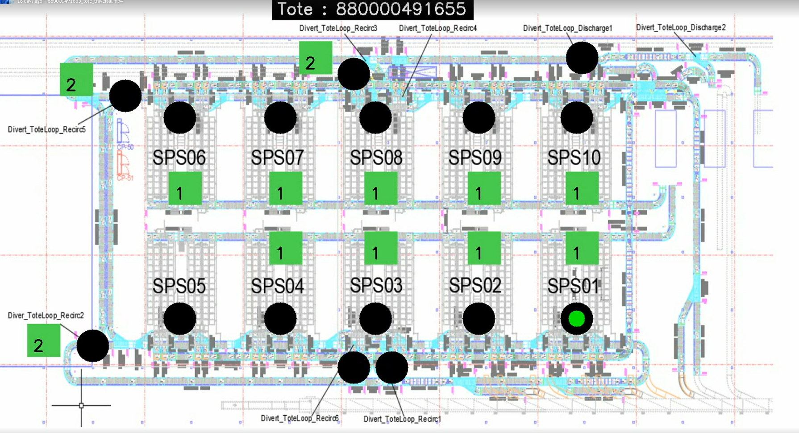
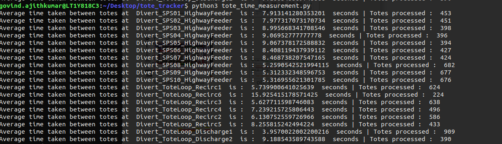
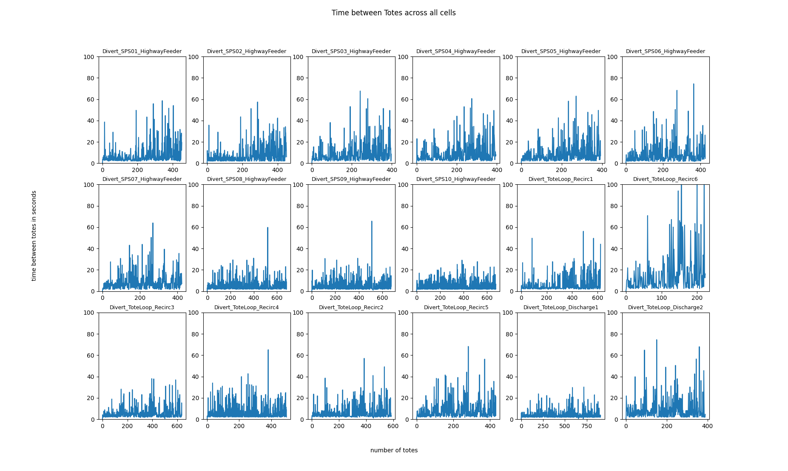

# tote_tracker

There are 2 functionalities in this repository:

- Tracking a totes journey through the system
- Tracking time between totes at any point

[Link to the source data for Ottawa](https://sunflower.kb.us-central1.gcp.cloud.es.io:9243/app/discover#/?_g=(filters:!(),refreshInterval:(pause:!t,value:0),time:(from:now-7d%2Fd,to:now))&_a=(columns:!(message,system_name),filters:!(),index:ce572630-0f58-11ed-bd81-e7f3585b181b,interval:auto,query:(language:kuery,query:'%22Divert%20decision%22%20%20and%20%22770000601205%22'),sort:!(!('@timestamp',desc))))

[Link to the source data for Jacksonville](https://sunflower.kb.us-central1.gcp.cloud.es.io:9243/app/discover#/?_g=(filters:!(),refreshInterval:(pause:!t,value:0),time:(from:now-7d%2Fd,to:now))&_a=(columns:!(message,system_name),filters:!(),index:ce572630-0f58-11ed-bd81-e7f3585b181b,interval:auto,query:(language:kuery,query:'%22Divert%20decision%22%20%20and%20%22770000601205%22'),sort:!(!('@timestamp',desc))))

[Link to the source data for Tote Tracker](https://sunflower.kb.us-central1.gcp.cloud.es.io:9243/app/discover#/?_g=(filters:!(),refreshInterval:(pause:!t,value:0),time:(from:now-1h,to:now))&_a=(columns:!(message,tote_id,location_id),filters:!(),index:ce572630-0f58-11ed-bd81-e7f3585b181b,interval:auto,query:(language:kuery,query:'%22arrived%22%20'),sort:!(!('@timestamp',desc))))

# How to use this repo

### To track tote journey throughout a system

- Go to the link above every file and download the raw CSV Data for your desired tote and timeframe
- Paste the .csv file in the site directory and rename it as **raw_file.csv**

**Note: Make sure the data in the CSV is in the reverse chronological order**

- Run with the python command : **python3 main.py**
- All videos will be saved in the videos directory
- Output looks like below:

  
 
### To track time between totes at locations

- Run with the python command : **python3 tote_time_measurement.py**
- Output looks like below:

| Terminal Output  | Graphical Output |
| ------------- | ------------- |
|   |  |

# File guide

| File Name  | File usage |
| ------------- | ------------- |
| map.py  | To mark out the stations on the map. This can be used initially to set the station locations for every site.  |
| common_helper.py  | Helper functions that can be used throughout this repo  |
| sunflower_ott_params.py  | Sunflower Client, Ottawa, Kansas specific parameters  |
| britton_jax_params.py  | Britton Client, Jacksonville, Texas specific parameters  |
| washington_phx_params.py  | Washington Client, Phoenix, Arizona specific parameters  |
| main.py  | Main file to be run to track the tote and save the video (if needed)  |
| tote_time_measurement.py  | Program to set measure the time between totes seen at all autoshuttle diverts and recirc locations  |

# Projects currently supported

| Client   | Location | 
| ------------- | ------------- | 
| Sunflower | Ottawa, Kansas |
| Britton | Jacksonville, Texas |
| Washington (in the works) | Phoenix, Arizona |

# Necessary Packages

| File Name  | 
| ------------- | 
| OpenCV |
| datetime |
| Pandas |
| Matplotlib |
